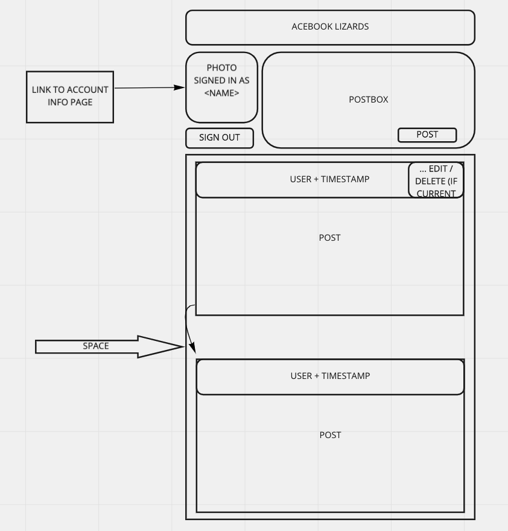

# AceBook

[](https://app.circleci.com/pipelines/github/AJ8GH/acebook-clone)
[](https://travis-ci.com/AJ8GH/acebook-clone)
[](https://app.circleci.com/pipelines/github/AJ8GH/acebook-clone)
[](https://coveralls.io/github/AJ8GH/acebook-clone?branch=master)
[](https://codeclimate.com/github/AJ8GH/acebook-clone/maintainability)
[](https://github.com/rubocop/rubocop)

## Beta Version

Checkout the beta version of AceBook - deployed here via Heroku and Circle CI:

[AceBook](https://rhubarb-tart-43037.herokuapp.com/)
-------------------------------------------------------

## Getting Started

#### Clone the repository

```shell
git clone git@github.com:AJ8GH/acebook-clone.git
```

#### Install dependencies

```shell
cd acebook-clone
bundle install
```

#### Set up Database

```
rake db:create
rake db:migrate
```

#### Running test suite

Run tests with rspec:

```shell
bundle exec rspec
```

Add the -fd flag for documentation format:
```shell
bundle exec rspec -fd
```

## Ruby Version

`2.7.2`

## Development Dependencies

```
acts_as_votable
byebug
capybara (~> 2.13)
coveralls_reborn (~> 0.21.0)
devise (~> 4.7)
dotenv
factory_bot_rails
jbuilder (~> 2.5)
jquery-rails (~> 4.4)
listen (>= 3.0.5, < 3.2)
mimemagic (~> 0.3.8)
pg
puma (~> 3.12.6)
rails (~> 6.0.0)
rspec-rails (~> 4.0)
rspec_junit_formatter
rubocop
rubocop-rails
sass-rails (~> 5.1.0)
selenium-webdriver
simplecov
therubyracer
tzinfo-data
uglifier (>= 1.3.0)
web-console (>= 3.3.0)
```

You can find the [engineering project outline](https://github.com/makersacademy/course/tree/master/engineering_projects/rails) here.

Planning:

[Miro board mock up](https://miro.com/app/board/o9J_lN6jG0E=/)


